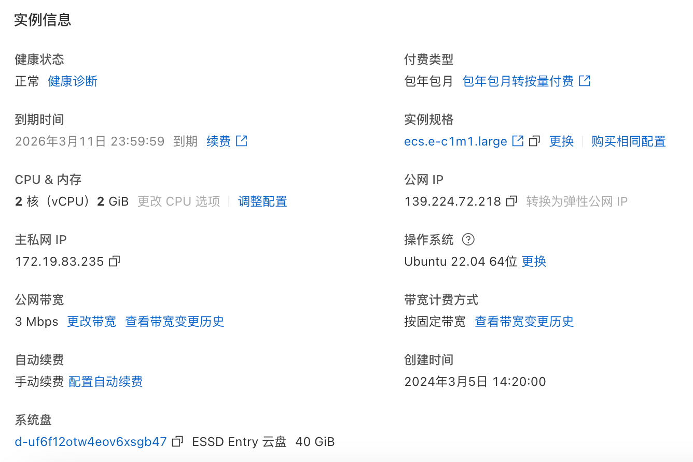

# 主权建置手册

本期视频为大家介绍使用 frp + Nginx 组合方案实现内网穿透，让本地部署的n8n服务，在外网通过域名就可以访问             

整体流程为:        
```
HTTPS请求 → ECS服务器Nginx(443端口,处理SSL) → frps(7171端口,HTTP转发) → 本地frpc → 本地n8n(5678端口)
```
frp 是一个完全开源的项目，专注于内网穿透的高性能的反向代理应用，支持 TCP、UDP、HTTP、HTTPS 等多种协议，且支持 P2P 通信。可以将内网服务以安全、便捷的方式通过具有公网 IP 节点的中转暴露到公网          

官网:https://gofrp.org/zh-cn/                
文档:https://gofrp.org/zh-cn/docs/                  
GitHub(星标 101k):https://github.com/fatedier/frp              

## 1、准备工作

本期视频是以阿里云平台服务进行介绍(其他云服务平台类似)，主要涉及阿里云云服务器ECS、域名(解析)、SSL证书(免费证书申请)               

### 1.1 阿里云云服务器ECS       

阿里云 https://www.aliyun.com/?spm=5176.ecs-console-networkv2_.console-base_top-nav.dlogo.25d44df5SuAArz           
进入阿里云官网选择适合自己的云服务器购买(可以查看官方的优惠政策)                        

本期视频所使用的服务器配置如下图所示       
其中，注意需要有公网IP、操作系统选择的是 Ubuntu 22.04 64位 (**后续的操作部分的运行指令均为该系统支持的，其他系统类似**)            

       

购买成功后，可登陆 https://ecs.console.aliyun.com/server/i-uf62pha36lltqxavnku3/detail?regionId=cn-shanghai#/ 到控制台管理实例       

### 1.2 域名及域名备案          

访问 https://wanwang.aliyun.com/domain/ 选择和购买域名，购买完成后在阿里云中进行域名备案，具体参考如下官网教程               

https://help.aliyun.com/zh/icp-filing/basic-icp-service/getting-started/quick-start-for-icp-filing-for-personal-websites?spm=5176.21213303.J_ZGek9Blx07Hclc3Ddt9dg.71.4b352f3daHnPdj&scm=20140722.S_help@@%E6%96%87%E6%A1%A3@@2836792._.ID_help@@%E6%96%87%E6%A1%A3@@2836792-RL_%E5%9F%9F%E5%90%8D%E5%A4%87%E6%A1%88-LOC_2024SPAllResult-OR_ser-PAR1_213e053417649148229577565e817f-V_4-PAR3_o-RE_new5-P0_2-P1_0            

域名备案完成后，登陆 https://dnsnext.console.aliyun.com/authoritative 添加域名并对域名进行解析          

### 1.3 SSL免费证书购买

访问 https://yundun.console.aliyun.com/?p=cas#/certExtend/buy/cn-hangzhou 进行SSL免费证书(个人测试证书)的购买             

购买完成等待审核，审核通过后CA会签发证书，后面会根据服务类型(使用的是Nginx)选择对应的证书下载              

## 2、frps + Nginx具体步骤

### 2.1 架构说明

整体流程为:        
```
HTTPS请求 → ECS服务器Nginx(443端口,处理SSL) → frps(7171端口,HTTP转发) → 本地frpc → 本地n8n(5678端口)
```

### 2.2 ECS服务器端配置

#### 2.2.1 安装Nginx

在你的Ubuntu ECS服务器上执行              

```bash
# 更新软件包索引
sudo apt update

# 安装Nginx
sudo apt install nginx

# 检查安装是否成功
nginx -v

# 启动Nginx
sudo systemctl start nginx
sudo systemctl enable nginx  # 设置开机自启
```

#### 2.2.2 配置frps服务端

首先访问 https://github.com/fatedier/frp/releases 下载适合操作系统的releases文件     
Ubuntu系统选择 frp_0.65.0_linux_amd64.tar.gz 进行下载，下载完成后将该文件上传至ECS服务器           

编辑frps配置文件`frps.toml`,添加HTTP虚拟主机端口:            

```toml
bindPort = 7000 # frp服务端口对外开放
vhostHTTPPort = 7171 # HTTP端口,由Nginx转发
```

**注意**:`vhostHTTPPort`会默认监听`0.0.0.0:7171`,为了安全也可以配置只监听本地                

重启frps服务:            
```bash
# 直接运行
./frps -c ./frps.toml     
```

也可使用nohup后台运行frps服务:             
```bash
# 直接运行
nohup ./frps -c frps.toml > frps.log 2>&1 &                 
# 查看是否启动成功
ps -ef | grep frps   
```

#### 2.2.3 上传SSL证书

访问 https://yundun.console.aliyun.com/?p=cas#/certExtend/buy/cn-hangzhou 将阿里云购买的Nginx格式证书下载后上传到服务器:              

```bash
# 创建证书目录
sudo mkdir -p /etc/nginx/ssl

# 上传证书文件(通过scp或其他方式)
# 假设证书文件为: your-domain.pem 和 your-domain.key
sudo mv your-domain.pem /etc/nginx/ssl/
sudo mv your-domain.key /etc/nginx/ssl/

# 设置权限
sudo chmod 600 /etc/nginx/ssl/your-domain.key
```

#### 2.2.4 配置Nginx反向代理

创建Nginx配置文件:                  

```bash
# 创建站点配置文件 n8n.nangeai.top 替换为你自己的域名
sudo vim /etc/nginx/sites-available/n8n.nangeai.top
```

添加以下配置:           

```nginx
# HTTP自动跳转HTTPS
server {
    listen 80;
    server_name n8n.nangeai.top;
    return 301 https://$host$request_uri;
}

# HTTPS服务
server {
    listen 443 ssl http2;
    server_name n8n.nangeai.top;
    
    # SSL证书配置(替换为自己实际的文件名称)
    ssl_certificate /etc/nginx/ssl/your-domain.pem;
    ssl_certificate_key /etc/nginx/ssl/your-domain.key;
    ssl_session_timeout 5m;
    ssl_protocols TLSv1.2 TLSv1.3;
    ssl_ciphers ECDHE-RSA-AES128-GCM-SHA256:HIGH:!aNULL:!MD5:!RC4:!DHE;
    ssl_prefer_server_ciphers on;
    
    # 日志配置
    access_log /var/log/nginx/n8n_access.log;
    error_log /var/log/nginx/n8n_error.log;
    
    # 反向代理到frps的vhost_http_port
    location / {
        proxy_pass http://127.0.0.1:7171;
        proxy_redirect off;
        
        # 重要:传递原始Host头给frp
        proxy_set_header Host $http_host;
        proxy_set_header X-Real-IP $remote_addr;
        proxy_set_header X-Forwarded-For $proxy_add_x_forwarded_for;
        proxy_set_header X-Forwarded-Proto $scheme;
        
        # WebSocket支持(如果n8n需要)
        proxy_http_version 1.1;
        proxy_set_header Upgrade $http_upgrade;
        proxy_set_header Connection "upgrade";
        
        # 超时设置
        proxy_connect_timeout 60s;
        proxy_send_timeout 60s;
        proxy_read_timeout 60s;
    }
}
```

启用站点配置:         
```bash
# 创建软链接
sudo ln -s /etc/nginx/sites-available/n8n.nangeai.top /etc/nginx/sites-enabled/

# 测试配置语法
sudo nginx -t

# 重载配置
sudo nginx -s reload
```

#### 2.2.5 配置安全组

访问 https://ecs.console.aliyun.com/server/i-uf62pha36lltqxavnku3/detail?regionId=cn-shanghai#/ 在阿里云ECS控制台添加安全组规则:              

- **80端口**(HTTP):允许`0.0.0.0/0`访问                    
- **443端口**(HTTPS):允许`0.0.0.0/0`访问                 
- **7000端口**(frp服务):允许`0.0.0.0/0`访问                     
- **7171端口**(HTTP端口,由Nginx转发):允许`0.0.0.0/0`访问                

配置完成后，可在服务器中查看配置是否生效         
```bash
# 查询状态
sudo ufw status

# 也可以通过指令开启端口
sudo ufw allow 7000/tcp

# 重载配置
sudo ufw reload
```

### 2.3 本地客户端配置

首先访问 https://github.com/fatedier/frp/releases 下载适合操作系统的releases文件     
MAC M芯片 选择 frp_0.65.0_darwin_arm64.tar.gz 进行下载                    

配置本地frpc，编辑本地机器的`frpc.toml`:                

```toml
serverAddr = "your-ecs-ip"
serverPort = 7000

[[proxies]]
name = "n8n-webhook"
type = "http"
localIP = "127.0.0.1"
localPort = 5678
customDomains = ["n8n.nangeai.top"]
```

启动frpc:
```bash
./frpc -c frpc.toml
```

## 3、验证和测试

### 3.1 验证配置

```bash
# 在ECS服务器上检查端口监听
sudo netstat -tlnp | grep nginx   # 应该看到80和443
sudo netstat -tlnp | grep frps    # 应该看到7000和7171

# 测试HTTPS证书
curl -I https://n8n.nangeai.top

# 或使用openssl验证
openssl s_client -connect n8n.nangeai.top:443 -servername n8n.nangeai.top
```

### 3.2 n8n服务测试

直接通过 https://n8n.nangeai.top 登陆n8n平台，实现外网可访问本地局域网内部署的n8n服务，需要对本地的n8n服务进行升级，打开命令行终端运行如下指令                   

`docker run -d --name n8n_v2 -p 5678:5678 -e GENERIC_TIMEZONE="Asia/Shanghai" -e TZ="Asia/Shanghai" -e WEBHOOK_URL=https://n8n.nangeai.top  -e N8N_HOST=n8n.nangeai.top -e N8N_PORT=5678 -e N8N_PROTOCOL=https -e N8N_CONCURRENCY_PRODUCTION_LIMIT=50 -e NODES_EXCLUDE="[]" -v /Volumes/Files/n8n:/home/node/.n8n -v /Volumes/Files/n8n-files:/home/node/.n8n-files docker.n8n.io/n8nio/n8n:2.0.1`          

### 3.3 Webhook测试

在Apifox中使用URL `https://n8n.nangeai.top/webhook-test/your-webhook-id` 进行Webhook测试                  


