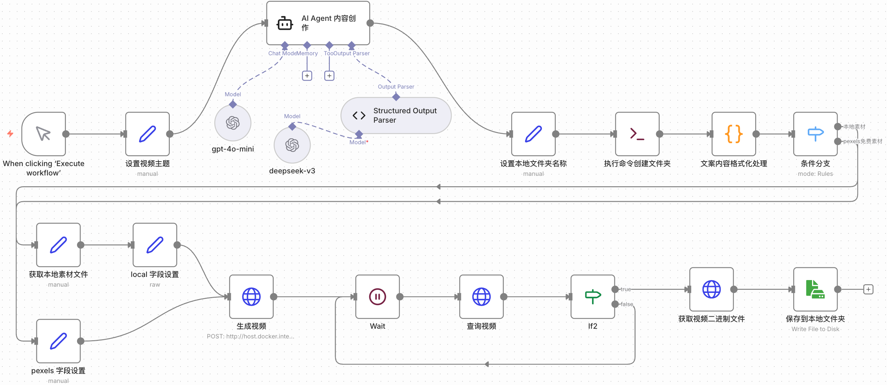

# n8n配置短视频生产线自动化工作流                   

## 1、工作流说明

本期视频为大家分享的是一个基于 n8n 构建的自动化短视频创作工作流，能够从文案撰写、素材获取到视频生成的全流程自动化处理，最终将成品视频保存到本地文件夹          
    
会为大家分享如何在n8n中结合短视频自动生成工具 MoneyPrinterTurbo 实现短视频自动化创作，工作流中还会涉及到之前为大家介绍过的AI Agent节点、Code节点、HTTP Request节点等                    

工作流实现的业务逻辑如下工作流所示:              

         

## 2、Docker部署MoneyPrinterTurbo

MoneyPrinterTurbo 是一个基于 Python 开发的开源 AI 短视频自动生成工具                
核心功能是只需提供一个视频主题或关键词，就能全自动生成视频文案、视频素材、视频字幕、视频背景音乐，并将这些元素合成为一个高清短视频          
支持 API 和 Web 界面两种操作方式                                  

**(1)下载项目**       

项目地址 https://github.com/harry0703/MoneyPrinterTurbo              
命令行终端运行 `git clone https://github.com/harry0703/MoneyPrinterTurbo.git` 下载项目或直接download              

**(2)初始化准备**               

- 大模型设置                     
这里使用的大模型代理平台:https://nangeai.top/                      
关于大模型代理平台如何使用 大家参考这期视频 https://youtu.be/mTrgVllUl7Y                       

- 视频素材源设置           
这里使用Pexels免费素材 https://www.pexels.com/api/ 申请API KEY                 
 
- TTS服务设置                     
这里默认使用的是硅基流动的语音合成 https://cloud.siliconflow.cn/me/account/ak 申请API KEY                    
语音测试及音色的选择 https://cloud.siliconflow.cn/me/playground/text-to-speech/17885302679           

**(3)修改配置文件**            

将源码中的 config.example.toml 文件复制一份，命名为 config.toml                                         
按照 config.toml 文件中的说明配置配置好Pexels、LLM、TTS                             

进入到MoneyPrinterTurbo，在 docker-compose.yml 文件内添加一行代码                                          
  `- /Volumes/Files/mpt/storage:/MoneyPrinterTurbo/storage`                  
其中，/Volumes/Files/mpt/storage 替换成自己的实际的文件夹绝对路径            

**(4)构建项目**      

命令行终端运行 `docker compose up -d` 启动服务容器                

注意:   

若中间出现 `ERROR [api internal] load metadata for docker.io/library/python:3.11-slim-bullseye` 报错                
可先运行指令 `docker pull python:3.11-slim-bullseye` 单独拉取后再运行 `docker compose up -d`           

**(5)容器启动成功后访问**            

访问 http://localhost:8501 服务Web端界面                           
访问 http://127.0.0.1:8080/docs API接口Web端页面                 

**(6)API接口调用**            

使用 http://host.docker.internal:8080/api/v1/videos 接口请求制作视频              

接口参数说明如下所示:                

- video_subject        
视频主题或内容来源，决定视频主要围绕的对象或话题             

- video_script     
视频脚本，即视频中的文字说明或旁白内容             
 
- video_terms   
视频相关的关键词，用于指导视频内容、搜索素材或优化标题。用英文的逗号隔开，且只支持英文                              

- video_aspect      
视频的宽高比，竖屏为9:16，横屏为16:9                        
  
- video_concat_mode      
视频合成模式，随机拼接(random)和顺序拼接(sequential)两种模式                          

- video_transition_mode        
视频剪辑间的过渡效果，包含无转场(None)、随机转场(Shuffle)、渐入(FadeIn)、渐出(FadeOut)、滑动入(SlideIn)、滑动出(SlideOut)                     

- video_clip_duration     
视频片段最大时长(不是视频总长度)，单位秒                 

- video_count            
生成视频数量                   

- video_source       
视频素材来源，支持pexels、pixabay、local                      

- video_materials           
预设的视频素材或文件，为空表示自动选取素材                       

- video_language         
视频语言，空值表示默认或自动匹配                 

- voice_name       
配音声音选择，国内使用硅基流动的“siliconflow:FunAudioLLM/CosyVoice2-0.5B:benjamin-Male”                

- voice_volume        
配音音量，取值范围一般0-1，1.0为最大音量                         

- voice_rate      
配音语速，1.0为1倍速        

- bgm_type        
背景音乐类型，支持无背景音乐、随机背景音乐、自定义背景音乐                     
  
- bgm_file          
当背景音乐类型为自定义背景音乐时，需要指定背景音乐文件，为空意味着不指定具体文件                            

- bgm_volume     
背景音乐音量，取值范围一般0-1，1.0为最大音量                          

- subtitle_enabled       
是否启用字幕，true或false                        

- subtitle_position    
字幕位置，支持top、center、bottom和自定义      

- custom_position      
当字幕位置类型为自定义则需设置字幕垂直偏移位置，单位为像素                     

- font_name       
字幕字体，如指定为“MicrosoftYaHeiBold.ttc”，即微软雅黑加粗               

- text_fore_color         
字幕文字颜色，"#FFFFFF"表示纯白色                            

- text_background_color        
是否显示字幕背景色，true表示打开背景色以增强可读性                

- font_size        
字幕字体大小，如设置为60         

- stroke_color         
字幕描边颜色，"#000000"表示黑色描边                  

- stroke_width          
字幕描边宽度，如1.5                   

- n_threads     
视频生成时使用的线程数，此处为2                        

- paragraph_number        
视频中的段落数或文本段数，这里为1           

## 3、测试

### 3.1 Web端测试        

运行服务后，直接访问 http://localhost:8501 进入服务Web端界面进行操作即可，支持中英文切换               

### 3.2 n8n工作流 + API 测试   
                  
首先，在 /Volumes/Files/mpt/storage(替换为自己的) 文件夹中新增一个文件夹 local_files 再在这个文件夹内添加3个子文件夹               
- bgm：存放本地的背景音乐文件           
- pictures：存放本地的图片素材文件               
- videos：存放本地的视频素材文件                 

测试主题内容:         
AI对当今社会生活的影响。                  
背带裤真是谁穿谁可爱呀，姨姨们觉得是小鱼穿可爱还是秋水哥哥穿可爱呀。                    

## 4、核心节点介绍

### 4.1 AI Agent 节点

AI Agent 节点是 n8n 中用于构建智能自动化流程的核心节点之一               
它代表了一个能够自主决策、调用外部工具和 API、并根据环境完成特定目标的智能体（Agent）            
与传统的 LLM（大语言模型）节点只负责文本生成不同，AI Agent 节点具备多步推理、工具调用和任务执行能力，适合处理更复杂的自动化场景            

**主要特点:**       

- **自主决策与多步推理:** AI Agent 节点可以根据输入内容，自动决定调用哪些工具（如数据库、API、Web Scraping 等），并多次循环执行，直到完成目标任务              
- **工具集成:** 必须至少连接一个工具子节点（如 HTTP 请求、数据库查询等），Agent 会根据任务自动选择合适的工具             
- **适用场景广泛:** 可用于构建聊天机器人、自动化数据分析、网页抓取、自动回复邮件等多种智能场景            
- **与 LLM 配合:** AI Agent 节点以 LLM 作为“推理引擎”，通过 prompt（提示词）与上下文信息驱动智能决策           
- **无需编码，低代码可视化配置:** 通过拖拽和参数配置即可实现复杂的智能体逻辑，适合开发者和业务人员快速搭建 AI 工作流             

**常见用法:**     

- 构建智能聊天机器人，自动理解用户意图并调用外部服务完成任务            
- 自动化数据处理、信息检索、内容生成等多步流程          
- 结合记忆管理节点，实现上下文连续的对话和任务处理AI Agentic 工作流介绍           
 
本期视频的工作流使用AI Agent节点会搭配LLM节点，LLM节点的配置涉及到第三方服务的凭证创建，这里使用的大模型代理平台                       
这里使用的大模型代理平台:https://nangeai.top/                  
关于大模型代理平台如何使用 大家参考这期视频 https://youtu.be/mTrgVllUl7Y                  

### 4.2 HTTP Request 节点

HTTP Request 节点是 n8n 中最强大、最通用的节点之一             
它允许你向任何支持 REST API 的应用或服务发起 HTTP 请求，实现数据的获取、发送或操作，非常适合对接没有专用 n8n 节点的第三方服务                

**主要功能与参数:**            

- **请求方法:** 支持 GET、POST、PUT、PATCH、DELETE、HEAD、OPTIONS 等常见 HTTP 方法，可满足绝大多数 API 场景需求                    
- **URL:** 填写目标 API 的接口地址                
- **认证方式:** 支持多种认证，包括预定义凭据（如已有的服务集成）、Basic Auth、Header Auth、Bearer Token、OAuth1、OAuth2 等。推荐优先使用预定义凭据，配置更简单             
- **请求头和参数:** 可自定义请求头（Headers）、查询参数（Query Parameters）、请求体（Body），支持表单、JSON、二进制等多种格式            
- **响应格式:** 可选择返回 JSON、字符串、二进制等格式，便于后续节点处理                    

**典型应用场景:**         

- 对接没有专用节点的第三方 API            
- 实现自定义数据抓取、推送、自动化操作            
- 结合其他节点，实现复杂的自动化业务流程           

本期视频会使用HTTP Request节点来调用飞书的消息服务和多维表格服务，若不清楚这两个服务如何在n8n中使用，建议你观看如下视频:              

03_【工作流】n8n配置飞书保姆级配置指南：HTTP Request节点 社区飞书节点 云空间 多维表格 群组即时消息 支持文本、图片、富文本、卡片、音视频、文件等                     
- 资料在项目内 workflows 文件夹中的 02_*** 文件夹，下载即可                                                                    
- YouTube频道对应视频: https://youtu.be/zhSKnqJa9to                                                            
- B站频道对应视频: https://www.bilibili.com/video/BV1aD2TBsEkZ/                       

### 4.3 Code节点

Code 节点是 n8n 中用于在工作流中编写和执行自定义代码的核心节点           
它支持 JavaScript 和（通过 Pyodide 的方式，有限支持）Python，可以灵活处理和转换数据，实现复杂的业务逻辑       

**主要特点:**            

- **支持语言:** 主要支持 JavaScript，部分版本支持 Python（基于 Pyodide，未来版本将不再支持 Python）              
- **两种执行模式:** Run Once for All Items：对所有输入数据一次性处理，适合需要聚合或整体处理的场景; Run Once for Each Item：对每个输入数据单独处理，适合逐条转换                        
- **内置方法与变量:** 可直接使用 n8n 提供的内置方法和变量，便于访问数据、环境信息等                  
- **外部库支持:** 自托管 n8n 可引入和使用 Node.js 内置模块及第三方 npm 包（需配置）。n8n Cloud 仅支持 crypto 和 moment 两个模块                
- **调试与开发体验:** 支持 console.log 输出调试信息，编辑器内有自动补全、多光标等              
- **数据结构要求:** 输出必须为数组格式，每个元素为包含 json 属性的对象，否则会报错               

**典型应用场景:**            

- 数据清洗、格式转换、聚合统计等               
- 复杂业务逻辑实现，如条件判断、批量处理等               
- 与其他节点配合，实现灵活的自动化流程               

                

